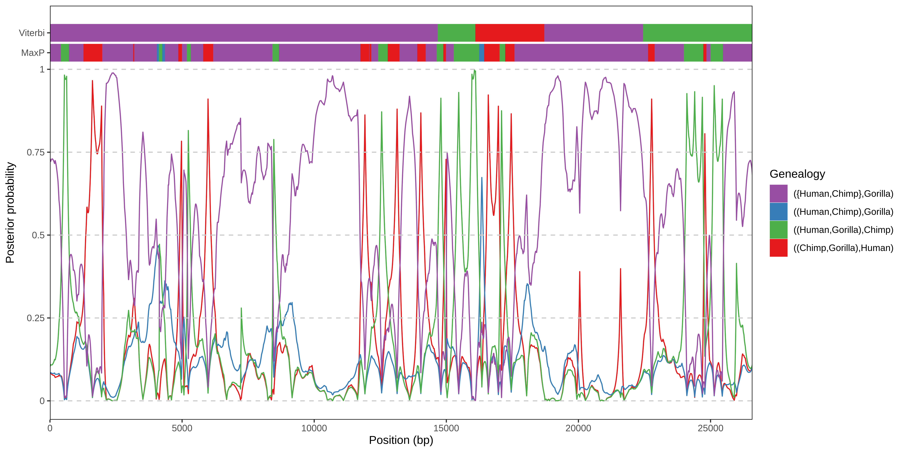

This repository contains the files needed to run the example analysis of iTRAILS chapter in Statistical Population Genomics 2nd edition. It should be run in the following order:

## 1- Install iTRAILS package:

iTRAILS can be installed as a pip package:

```bash
pip install itrails
```

Or as a conda package from conda-forge

```bash
conda install conda-forge::itrails
```

## 2- Download necessary alignment file

Download the example 4 way alignment file from a chromosome 1 region between Human, Chimpanzee, Gorilla and Sumatran Orangutan (outgroup), available in Zenodo.

[](https://doi.org/10.5281/zenodo.14930374)

Place the file in `./data/input/optimization/4way_chr1_human_chimp_gorilla_orangutan.maf`.

## 3- Run optimization of parameters

Use the Command Line Interface (CLI) to run the optimization:

```bash
itrails-optimize "./data/input/optimization/example_config.yaml" --input "./data/input/optimization/4way_chr1_human_chimp_gorilla_orangutan.maf" --output "./data/output/optimization/example"
```

For the given output, optimization was run for 3 hours in a HPC with 64 CPUs and 1GB allocated per CPU. Optimization results can be seen in `./data/output/optimization`.

## 4- Run Viterbi decoding

Use the Command Line Interface (CLI) to run Viterbi decoding using the resulting best model from the optimization as input:

```bash
itrails-viterbi "./data/output/optimization/example.best_model.yaml"
```

Viterbi results shown in `./data/output/viterbi/exampleblck32.viterbi.csv` are pruned to alignment block number 32 for tidyness, output for the viterbi function will include in similar order information for every alignment block named as `example.viterbi.csv`.

## 5- Run posterior decoding

Use the Command Line Interface (CLI) to run posterior decoding using the resulting best model from the optimization as input:

```bash
itrails-posterior "./data/output/optimization/example.best_model.yaml"
```

Posterior results shown in `./data/output/posterior/exampleblck32.posterior.csv` are pruned to alignment block number 32 for tidyness, output for the posterior function will include in similar order information for every alignment block named as `example.posterior.csv`.

## 6- Plot posterior probabilities along with most likely topology based on posterior/Viterbi decoding

The final figure of the chapter (figure 3) can be reproduced by running the R code `./generate_plot.R` on a R environment with the tidyverse package. The figure shows the aggregated likelihood of each tree topology along the 32nd alignment block, as well as the most likely topologies based on Viterbi decoding and posterior decoding.

### Figure:


